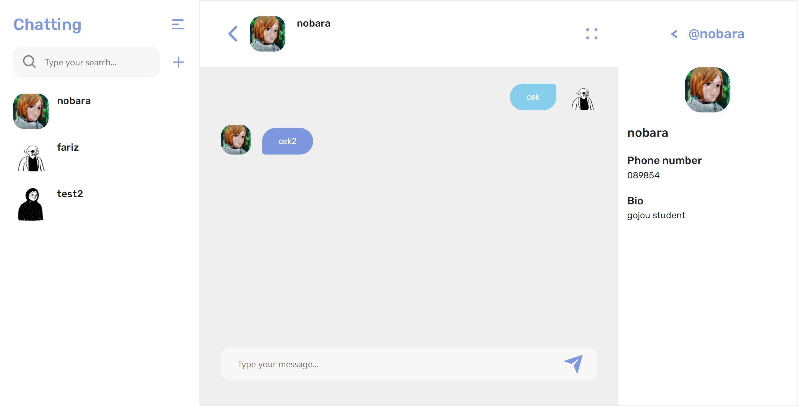
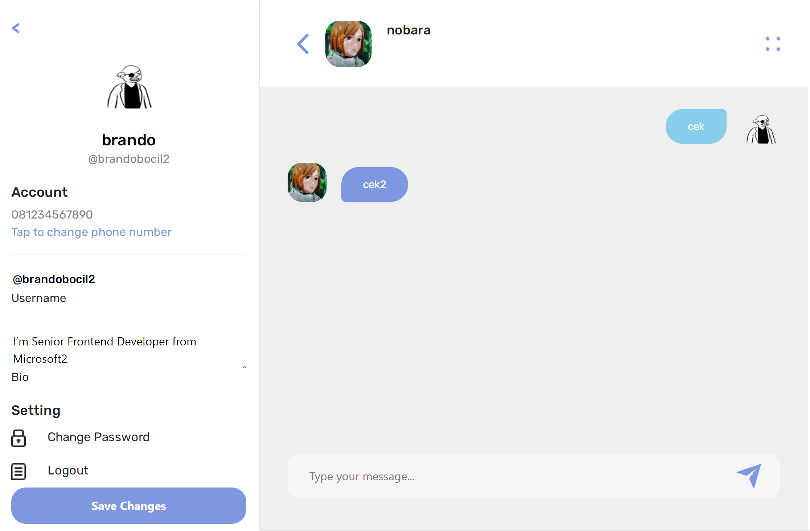
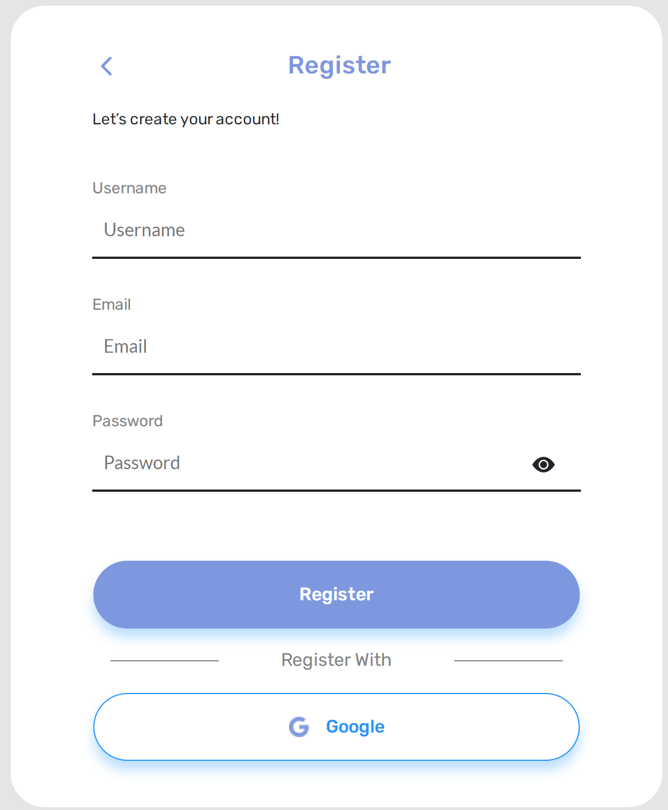
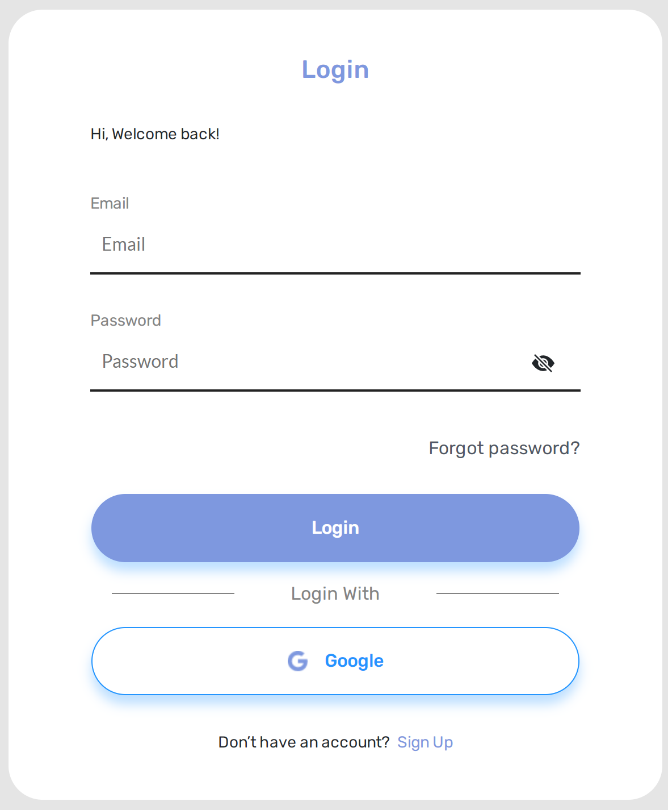
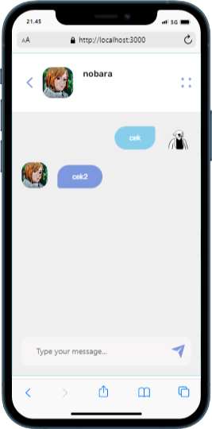
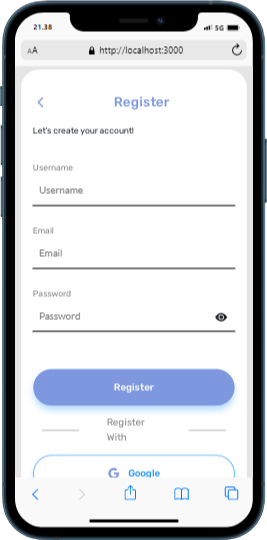
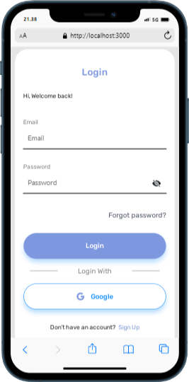
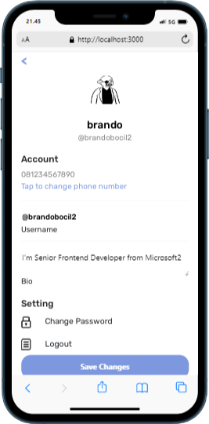
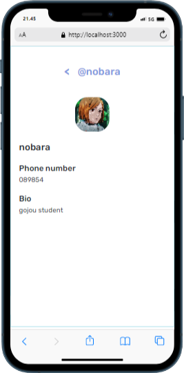

<div id="top"></div>

<!-- PROJECT LOGO -->
<br />
<div align="center">

<h3 align="center">Chatting Web App</h3>

  <p align="center">
    A ReactJs project chat app
    <br/>
    
  </p>
</div>


<!-- TABLE OF CONTENTS -->
<details>
  <summary>Information</summary>
  <ol>
    <li>
      <a href="#about-the-project">About The Project</a>
      <ul>
        <li><a href="#built-with">Built With</a></li>
      </ul>
    </li>
    <li><a href="#demo">Demo</a></li>
    <li>
      <a href="#getting-started">Getting Started</a>
      <ul>
        <li><a href="#installation">Installation</a></li>
      </ul>
    </li>
    <li><a href="#screenshot">Screenshot</a></li>
    <li><a href="#contact">Contact</a></li>
  </ol>
</details>


<!-- ABOUT THE PROJECT -->
## About The Project



Chatting app is a web application for chatting, with features of notification, online status, and edit profile.
built with ReactJs, and Redux on the front end, and ExpressJs, NodeJs, and Socket.io on the backend.

<p align="right">(<a href="#top">back to top</a>)</p>


### Built With

* [React.js](https://reactjs.org/)
* [Redux](https://redux.js.org/)
* [Socket.io](https://socket.io/)
* [Reactstrap](https://reactstrap.github.io/)
* [Axios](https://www.npmjs.com/package/axios)
* [Vercel](https://vercel.com/)
* [Heroku](https://www.heroku.com/)
* [backend](https://github.com/farizian/chattingBE)
* [Demo](https://chatting-rho.vercel.app/)


<p align="right">(<a href="#top">back to top</a>)</p>

<!-- GETTING STARTED -->
<div id="demo"></div>

## Demo
This is a link to the demo [Chatting App](https://chatting-rho.vercel.app/)
- Login user
  ```
  email: nobara@gmail.com
  pass: 123
  ```
- email: brando@gmail.com
  pass: 123

<!-- GETTING STARTED -->
<div id="getting-started"></div>

## Getting Started

### Quick Start (Using Existing Backend)

The application is already configured to work with the deployed backend. You can:

1. **Regular User Chat** (with backend integration):
   - Use the login page normally
   - Register new accounts
   - Chat with other users
   - Backend URL: https://chatting-be-production.up.railway.app/

2. **Room-based Chat** (no backend required):
   - Visit: `http://localhost:3000/?room=true`
   - Enter username and room ID
   - Start chatting immediately

### Demo Accounts (for testing with backend)
- Email: nobara@gmail.com, Password: 123
- Email: brando@gmail.com, Password: 123

### Prerequisites
* npm
  ```sh
  npm install npm@latest -g
  ```

### Installation

1. Clone the repo
   ```sh
   git clone https://github.com/farizian/chatting
   ```
2. Install NPM packages
   ```sh
   npm install
   ```
3. (Optional) Create your API in file `.env` if you want to use a different backend
   ```.env
   REACT_APP_API_URL=https://your-backend-url.com/
   ```
4. Start the development server
   ```sh
   npm start
   ```

### Backend Repository
- [Backend Source Code](https://github.com/farizian/chattingBE)
- [Live Backend API](https://chatting-be-production.up.railway.app/)

<p align="right">(<a href="#top">back to top</a>)</p>


<!-- ROADMAP -->
## Screenshot

>Web page

Chat page           |  Setting
:-------------------------:|:-------------------------:
  |  

register           |  Login
:-------------------------:|:-------------------------:
  |  


>Mobile page

Chat page           |  User
:-------------------------:|:-------------------------: 
  |  

Register           |  Login
:-------------------------:|:-------------------------:
  |  

Setting           |  Profile
:-------------------------:|:-------------------------:
  |  

<p align="right">(<a href="#top">back to top</a>)</p>


<!-- CONTACT -->
## Contact

Fariz Irfan Rifai  - [@instagram](https://www.instagram.com/farizirfan008/) - farizirfan8@gmail.com


<p align="right">(<a href="#top">back to top</a>)</p>

