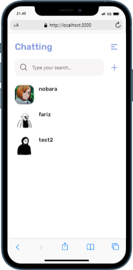

<div id="top"></div>

<!-- PROJECT LOGO -->
<br />
<div align="center">

<h3 align="center">Chatting Web App</h3>

  <p align="center">
    Chatting App
    <br/>
    
  </p>
</div>


<!-- TABLE OF CONTENTS -->
<details>
  <summary>Information</summary>
  <ol>
    <li>
      <a href="#about-the-project">About The Project</a>
      <ul>
        <li><a href="#built-with">Built With</a></li>
      </ul>
    </li>
    <li>
      <a href="#getting-started">Getting Started</a>
      <ul>
        <li><a href="#installation">Installation</a></li>
      </ul>
    </li>
    <li><a href="#screenshot">Screenshot</a></li>
    <li><a href="#contact">Contact</a></li>
  </ol>
</details>


<!-- ABOUT THE PROJECT -->
## About The Project


<p align="right">(<a href="#top">back to top</a>)</p>


### Built With

* [React.js](https://reactjs.org/)
* [React.js](https://reactjs.org/)
* [Redux](https://redux.js.org/)
* [Socket.io](https://socket.io/)
* [Reactstrap](https://reactstrap.github.io/)
* [Axios](https://www.npmjs.com/package/axios)
* [backend](https://github.com/farizian/chattingBE)
* [Demo](https://chatting-rho.vercel.app/)


<p align="right">(<a href="#top">back to top</a>)</p>


<!-- GETTING STARTED -->
## Getting Started

Chatting app is a web application for chatting, with features of notification, online status, and edit profile.
built with ReactJs, and Redux on the front end, and ExpressJs, NodeJs, and Socket.io on the backend.


### Installation

1. Clone the repo
   ```sh
   git clone https://github.com/farizian/chatting
   ```
2. Install NPM packages
   ```sh
   npm install
   ```
3. Start the Application
   ```js
   npm start
   ```

<p align="right">(<a href="#top">back to top</a>)</p>


<!-- ROADMAP -->
## Screenshot

>Web page

Chat page           |  Setting
:-------------------------:|:-------------------------:
  |  

register           |  Login
:-------------------------:|:-------------------------:
  |  


>Mobile page

Chat page           |  User
:-------------------------:|:-------------------------: 
  |  

Register           |  Login
:-------------------------:|:-------------------------:
  |  

Setting           |  Profile
:-------------------------:|:-------------------------:
  |  

<p align="right">(<a href="#top">back to top</a>)</p>


<!-- CONTACT -->
## Contact

Fariz Irfan Rifai  - [@instagram](https://www.instagram.com/farizirfan008/) - farizirfan8@gmail.com


<p align="right">(<a href="#top">back to top</a>)</p>

